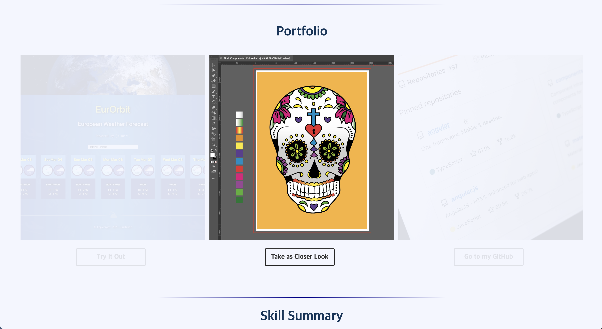
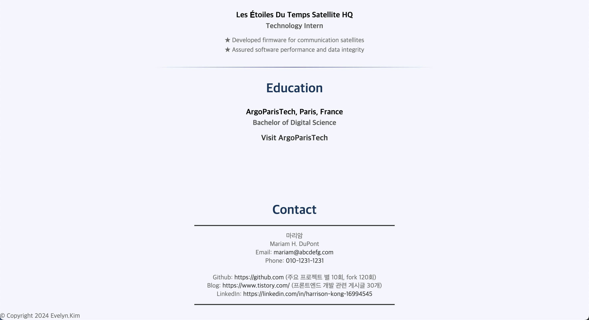

# 직관적인 사용자 경험을 제공하는 반응형 포트폴리오 웹사이트

##### 참여자: 김현지 (개인 프로젝트)  
  
#### 프로젝트 기간: 2024.03.20 ~ 2024.3.24 (4일)  
  
#### 프로젝트 도구: Swiper.js
  
#### 사용 언어: Html, Css, Javascript  
  
### 프로젝트 개요  
 - 소프트웨어 개발자와 시스템 분석가를 겸직하는 Mariam H. DuPont의 포트폴리오 웹사이트임.
 - 자신의 경력, 기술, 프로젝트 및 연락처 정보를 구체적으로 보여줄 수 있도록 구현.
 - 반응형 디자인 적용으로 데스크톱과 모바일 환경 모두에서 사용자가 편리하게 접근 가능.
  
### 프로젝트 배경  
#### 목적: 
  - 개발자 경력 강조 및 직무 관련 프로젝트를 시각적으로 표현하여 잠재적인 고용주나 클라이언트에게 효과적인 테스닉 PR 목적.  
  
#### 배경: 
  - 웹 개발 및 시스템 분석 경험을 시각적으로 표현하는 것이 중요하다고 판단되어, 웹사이트 형태로 포트폴리오를 구성하게 됨. 
  - San Francisco Bay Area에서 활동하는 가상의 인물이 다양한 프로젝트를 통해 쌓은 기술을 정리하여 한눈에 볼 수 있도록 구성. 이를 통해 Mariam의 경력과 역량을 쉽게 파악하고 신뢰할 수 있도록 함.
  
### 프로젝트 진행 과정  
1. Html 구조 설정
  - 전체 웹 페이지의 구조를 명확하게 구분하기 위해 `
` 요소를 사용하여 섹션 나누기.
  - 섹션별 목적을 가지고 있으며, 예를 들어 `<header>`, `
`, `<footer>` 등.
  - 유저의 포트폴리오에 포함된 주요 내용은 소개, 기술 요약, 경력 하이라이트, 학력, 연락처 등으로 구성.

2. 리셋 CSS 적용
  - 브라우저마다 기본적으로 제공하는 스타일이 다를 수 있으므로, 일관된 스타일을 유지하기 위해 리셋 CSS를 적용.
  - `<link rel="stylesheet" href="https://cdn.jsdelivr.net/npm/reset-css@5.0.2/reset.min.css">`를 사용하여 모든 브라우저에서 초기화된 스타일을 사용할 수 있도록 함.

3. 포트폴리오 슬라이더 요소 생성
  - 포트폴리오를 시각화하여 소개하기 위해 Swiper.js 기능 구현.
  - 각 포트폴리오 항목은 이미지와 버튼으로 구성되며, 사용자가 클릭하여 더 많은 정보를 얻을 수 있도록 링크를 포함시켰음.

4. 메뉴 및 상호작용 요소 추가
  - `<header>` 요소 내부에 메뉴를 추가하고, `<ul>`과 `<li>`를 사용하여 네비게이션 구현.
  - 메뉴는 사용자가 페이지 내의 특정 섹션으로 이동하도록 구현.
  - 버튼과 링크에 호버 효과를 추가하여 사용자 경험 개선. 버튼 색상과 배경색이 부드럽게 변하도록 구현.

5. 연락처 및 소셜 링크 구성
  - `
` 섹션을 만들어 고용주 또는 클라이언트가 쉽게 연락할 수 있도록 이메일, 전화번호, GitHub, 블로그, LinkedIn 등의 정보 제공함. 

6. JavaScript로 동적 기능 추가
  - Swiper 슬라이더 기능 구현을 위해 외부 라이브러리 Swiper.js 사용. ``로 라이브러리 로드 및 `포트폴리오`시각화 구현에 동적 기능을 추가함.

  

  
  

  

  
  

  

  
  

  

